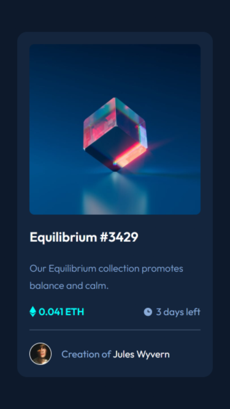
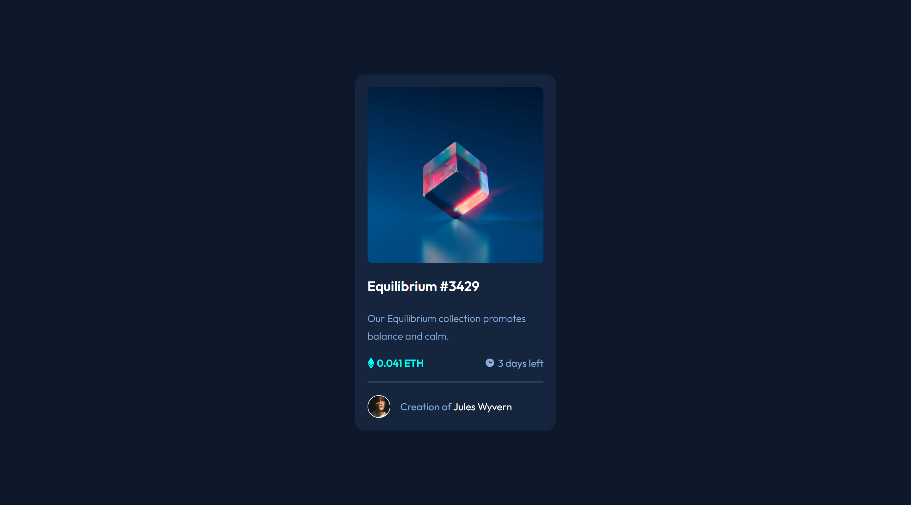

# Frontend Mentor - NFT preview card component solution

This is a solution to the [NFT preview card component challenge on Frontend Mentor](https://www.frontendmentor.io/challenges/nft-preview-card-component-SbdUL_w0U). Frontend Mentor challenges help you improve your coding skills by building realistic projects.

## Table of contents

- [Overview](#overview)
  - [The challenge](#the-challenge)
  - [Screenshot](#screenshot)
  - [Links](#links)
- [My process](#my-process)
  - [Built with](#built-with)
  - [Useful resources](#useful-resources)
- [Author](#author)
- [Acknowledgments](#acknowledgments)

## Overview

### The challenge

Users should be able to:

- View the optimal layout depending on their device's screen size
- See hover states for interactive elements

### Screenshot

📱 Mobile

💻 Desktop

### Links

- Live Site Here: [https://fermop.github.io/Frontend_Mentor-8thChallenge/](https://fermop.github.io/Frontend_Mentor-8thChallenge/)

## My process

### Built with

- Semantic HTML5 markup
- CSS custom properties
- Flexbox
- Mobile-first workflow
- BEM methodology
- Minified documents

### Useful resources

- [BEM Methodology](https://9elements.com/bem-cheat-sheet/) - This helps me to know where exactly I'm working on so I don't have to create classes with some weird names haha.
- [Normalize.css](https://necolas.github.io/normalize.css/) - This file makes browsers render all elements more consistently and in line with modern standards. It precisely targets only the styles that need normalizing.
- [HTML Minifier](https://codebeautify.org/minify-html) - This page helps to have all your html document written in a single line.
- [CSS Minifier](https://cssminifier.org/) - This page helps to have all your css document written in a single line.

## Author

- Frontend Mentor - [@fermop](https://www.frontendmentor.io/profile/fermop)
- Instagram - [fermop_](https://www.instagram.com/fermop_/)
- Facebook - [Fernando Mojica](https://www.facebook.com/fernando.mojica.758737/)

## Acknowledgments

I have to say thank you to [AlexCG Design](https://www.youtube.com/shorts/3oFZo-MDJtI), whithout you this design wouldn't be possible. I didn't know anything about the `::after` pseudo-element and the importance of using it on this challenge. I used it when the user hovers over the image and the view icon just appears. I really really owe you one!